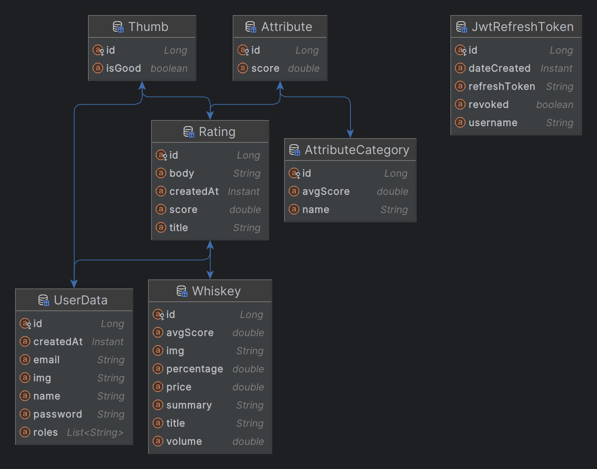

# Unrated Application - Backend

Welcome to the backend repository for Unrated, a whiskey rating application developed by Unrated Limited Unlimited Ltd.

The backend tries to offer a robust platform for whiskey enthusiasts to review, and discover whiskeys based on a wide range of criteria.

The backend is being hosted at:
```
https://api.unrated.no/
```

## Technologies
- Micronaut
- GraphQL
- JPA
- JWT
- Kotlin

## Requirements
- JDK 17 or later
- Gradle 8.5 or later

## Installation
1. **Clone the repository:**
    ```bash
    git clone https://github.com/Unrated-Limited-Unlimited/ua-backend.git
    cd ua-backend
    ```

2. **Build the project:**
    ```bash
    ./gradlew build
    ```

3. **Run the application:**
    ```bash
    ./gradlew run
    ```

## Usage
The backend application can then be accessed via:
- **OpenAPI documentation:**
```
http://localhost:8000/
https://api.unrated.no/
```
- **GraphQL Playground:**
```
http://localhost:8000/graphiql
https://api.unrated.no/graphiql
```

### GraphQL Schema
Refer to `schema.graphqls` file in `src/main/resources/` for the full GraphQL schema, 
which includes definitions for queries, mutations, types, and inputs required for interacting with the application.
Or use the playground as stated above.

### API Endpoints
See OpenAPI documentation for further details. Overview:

- **Image Upload:**
  - Profile Image Upload: POST `/img/profile` (uploads a profile image for the authenticated user)
  - Whiskey Image Upload: POST `/img/whiskey/{id}` (uploads an image for a specific whiskey, admin access required)


- **User Authentication:**
  - Login: POST `/login` (Login user using username and password to generate a JWT token)
  - Logout: POST `/logout` (invalidates all created refresh tokens)
  - Registration: POST `/register` (registers a new user with email, username, and password)


- **GraphQL**
  - GraphQL: POST `/graphql` (See `schema.graphqls` or `/graphiql` playground for details) 

### Example GraphQL Queries

Here are some example GraphQL queries and mutations:
```graphql
# Retrieve a list of all whiskey ratings by a specific user
query {
    getUser(name: "Jeff") {
      ratings {
        title
        body
        score
      }
    }
}
```
```graphql
# Create a new user and return id, name and email
mutation {
  createUser(user: {
    name: "NewUser",
    email: "newuser@example.com",
    password: "SecureNP#x&t@4S2Password#!"
  }) {
    id
    name
    email
  }
}
```

## Implementation Overview

### JPA classes


### JWT Security
We use JWT tokens for authentication. 
JWT tokens are stateless and are returned as set-cookie on `/login`.
Bearer JWT tokens are also accepted.

### Graphql
All the mutations and query functions are first defined in `schema.graphqls`.
The schema is parsed in `GraphQLFactory`, where the definitions are *linked* to different fetcher functions.
The fetcher functions return different Jpa model objects, were the DataFetcher maps every field value of the object,
to the return type of the query/mutation function defined in the schema.

Example: 
1. `getWhiskey(id: ID!) : Whiskey` is first defined in `schema.graphqls`.
2. It is then mapped to the fetcher function `WhiskeyFetcher::getWhiskey()` inside `GraphQLFactory`.
3. The fetcher function is called on request call, and returns a `DataFetcher<Whiskey>`.
4. The DataFetcher returns all fields of the Jpa Whiskey object that are also present in the schema. 
- (This makes it so UserData.password won't be serialized, since type UserData in `schema.graphqls` does not have a field called password for type UserData.)